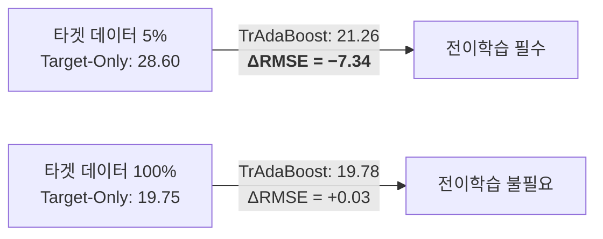

# Tier 7 실험 결과 분석 보고서 — Cross-Disease Transfer (T1D → T2D)

---

## 1. 실험 배경 및 동기

### 1.1 문제 정의

연속 혈당 모니터링(CGM) 기반 예측 모델은 대부분 제1형 당뇨병(T1D) 환자를 대상으로 개발되었다.
T1D는 인슐린 펌프 사용, 잦은 CGM 착용, 임상 연구 참여도가 높아 대규모 공개 데이터가 풍부하다.

반면, 전 세계 당뇨 환자의 약 90~95%를 차지하는 **제2형 당뇨병(T2D)** (IDF Diabetes Atlas, 10th ed., 2021) 및
비당뇨(ND) 집단은 공개 CGM 데이터가 구조적으로 부족하다.
이 불균형은 공개 데이터셋 목록에서 직접 확인할 수 있다:

- **Awesome-CGM** (Broll et al., 2024): CGM 공개 데이터셋의 체계적 카탈로그. 등재된 데이터셋의 대다수가 T1D 코호트이며, T2D 전용 데이터셋은 ShanghaiT2DM(100명) 등 극소수에 불과하다. Hall_2018(57명)이나 Colas_2019(208명) 등은 T2D를 포함하나 혼합 코호트이다.
- **Glucose-ML** (arXiv:2507.14077): 10개 공개 데이터셋(2018~2025)을 수집한 벤치마크. 전체 2,500명 이상 중 T2D 전용 코호트는 ShanghaiT2DM 1개뿐이다.
- **GlucoBench** (Cini et al., 2024): 5개 공개 데이터셋 기반 벤치마크로, T2D의 과소 대표를 문제로 명시적으로 지적하고 있다.

이 불균형의 원인은 T2D 환자의 CGM 착용률이 낮고, T2D 중심 임상 연구가 T1D에 비해 적기 때문이다.
CGM이 원래 T1D 관리를 위해 도입되었으며, T2D에 대한 CGM 처방이 확대된 것은 최근의 추세이다.

이러한 데이터 편향 하에서 핵심 질문은 다음과 같다:
T1D 모델을 T2D/ND 집단에 그대로 적용할 수 있는가? 적용했을 때 성능 저하가 발생하는가?
발생한다면, 어떤 기법으로 이 격차를 줄일 수 있는가?

이 실험은 위 질문에 답하기 위해 설계되었다.

### 1.2 핵심 가설

1. T1D와 T2D/ND는 혈당 변동 패턴이 다르므로, T1D 모델을 다른 집단에 적용하면 **성능 저하(negative transfer)**가 발생할 것이다.
2. 도메인 정렬(CORAL) 또는 인스턴스 재가중(TrAdaBoost) 기법을 적용하면 이 성능 저하를 완화할 수 있을 것이다.

### 1.3 선행 연구 및 차별점

CGM 혈당 예측에서 전이학습을 다룬 기존 연구는 주로 **환자 간 개인화**(population → individual)에 집중해 왔다.

- **OhioT1DM 기반 개인화**: 다수 T1D 환자의 데이터로 사전학습한 후, 개별 환자에 fine-tuning하는 접근이 다수 보고되었다 (e.g., Li et al., 2019; Zhu et al., 2022). 그러나 이들은 모두 **동일 코호트 내**에서의 전이이며, 소스와 타겟의 질병 유형이 동일하다.
- **Glucose-ML** (arXiv:2507.14077): T1D/T2D/ND/전당뇨를 포함한 10개 데이터셋으로 벤치마크를 수행하였으나, 동일 알고리즘이 데이터셋에 따라 성능이 크게 변동한다는 관찰에 그쳤으며, **소스-타겟 간 전이 실험은 수행하지 않았다.**
- **GlucoBench** (Cini et al., 2024): 5개 데이터셋 표준화 벤치마크. 다양한 딥러닝 아키텍처를 비교하였으나, 역시 개별 데이터셋 내 학습/평가에 한정되었다.

**질병 유형 간 전이**(T1D → T2D)를 체계적으로 비교한 연구는 현재까지 확인되지 않는다.
이는 T2D 공개 데이터셋 자체가 부족했기 때문에, 전이 실험을 설계할 수 있는 소스-타겟 쌍이 제한적이었던 데 기인한다.

이 실험은 **동일한 평가 프레임워크**(5-Way 비교)로 3개의 서로 다른 타겟 집단에 대해 전이 성능을 측정함으로써,
도메인 갭의 크기와 전이학습의 효과를 정량적으로 비교하는 최초의 시도이다.

---

## 2. 실험 설계

### 2.1 전이학습 구조

```
Source (대규모 T1D)  ─────────>  Target (소규모 T2D/ND)
                                    |
                                    ├── 직접 적용 (zero-shot)
                                    ├── 단순 혼합 (mixed)
                                    ├── 분포 정렬 (CORAL)
                                    └── 인스턴스 재가중 (TrAdaBoost)
```

### 2.2 5-Way 비교 모델

모든 타겟 데이터셋에 대해 동일한 6개 모델을 학습/평가한다.
타겟의 test set(15%)은 모든 모델에서 동일하게 사용된다.

| 모델 | 학습 데이터 | 역할 |
|---|---|---|
| **Source-Only** | T1D 소스 전체 | 전이 없이 직접 적용. 도메인 갭의 크기를 측정. |
| **Target-Only** | T2D 타겟 train(70%) | 전이 없는 하한 기준선. 타겟 데이터만으로 어디까지 가능한가. |
| **Mixed** | T1D + T2D 단순 합산 | 가장 단순한 전이 방식. negative transfer 여부를 판별. |
| **CORAL** | CORAL 정렬된 T1D + T2D | 소스의 공분산 구조를 타겟에 맞게 정렬한 후 학습. |
| **TrAdaBoost** | 재가중 T1D + T2D | 타겟 분포에 맞지 않는 소스 인스턴스의 가중치를 반복적으로 감소. |
| **Oracle** | T2D 전체 10-fold CV | 현실적으로 불가능한 상한. 타겟 데이터 전체를 사용한 최적 성능. |

### 2.3 전이학습 방법론 상세

**CORAL (Correlation Alignment)**
- 소스 데이터의 공분산 행렬을 타겟의 공분산 행렬에 선형 정렬한다.
- 피처 수준의 분포 차이를 줄이는 비지도 방법으로, 타겟 레이블을 사용하지 않는다.
- 한계: 비선형 분포 차이에는 대응하지 못한다.

**TrAdaBoost (Transfer AdaBoost)**
- 소스와 타겟을 함께 학습하되, 각 반복에서 타겟 예측 오차가 큰 소스 인스턴스의 가중치를 감소시킨다.
- 이를 통해 타겟과 유사한 소스 데이터는 유지하고, 이질적인 소스 데이터는 자동으로 걸러낸다.
- 후반 10개 모델의 앙상블로 안정적 예측을 수행한다.

이 두 방법은 딥러닝이 아닌 **머신러닝(LightGBM) 수준**에서 적용 가능한 전이학습 기법이다.

### 2.4 데이터셋 구성

Glucose-ML 논문은 각 데이터셋을 해당 CGM 센서의 고유 샘플링 주기(5분 또는 15분)에 따라
개별적으로 전처리하며, 서로 다른 주기의 데이터를 보간하여 통합하지 않는다 (Glucose-ML, Section 5.3).
동일 스텝 수(PREDICTION_STEPS = 3)에서도 물리적 예측 시간이 달라지므로 (5분 주기: 15분 뒤, 15분 주기: 45분 뒤),
이 원칙을 준수하여 주기별로 실험 그룹을 분리하였다.

**15분 주기 그룹** — 3 steps = 45분 뒤 예측

| 역할 | 데이터셋 | 질병 유형 | 환자 수 | Window 수 |
|---|---|---|---|---|
| Source | ShanghaiT1DM | T1D | 12 | 15,437 |
| Source | Bris-T1D_Open | T1D | 20 | 847,468 |
| **Source 합계** | | | **32** | **862,905** |
| Target | **ShanghaiT2DM** | **T2D** | **100** | **111,603** |

**5분 주기 그룹** — 3 steps = 15분 뒤 예측

| 역할 | 데이터셋 | 질병 유형 | 환자 수 | Window 수 |
|---|---|---|---|---|
| Source | RT-CGM | T1D | 448 | 17,120,735 |
| Source | IOBP2 | T1D | 440 | 14,189,039 |
| Source | FLAIR | T1D | 113 | 5,501,972 |
| Source | SENCE | T1D | 143 | 4,919,461 |
| Source | WISDM | T1D | 203 | 6,687,728 |
| Source | PEDAP | T1D | 103 | 7,183,125 |
| **Source 합계** | | | **1,450** | **55,602,060** |
| Target | **CITY** | **Mixed** (T1D/T2D/ND) | **153** | **3,664,643** |
| Target | **Colas_2019** | **Mixed** (ND→T2D 위험군) | **208** | **113,213** |

5분 그룹의 소스 풀(5,560만 windows)은 비례 서브샘플링(1,000,000 windows)으로 축소하여 학습 속도를 확보하였다.
각 데이터셋이 전체에서 차지하는 비율에 따라 할당량을 배분하여 집단 다양성을 유지하였다.

### 2.5 피처 설계

과거 3 스텝(LOOKBACK_STEPS = 3)의 혈당 시계열로부터 22개의 피처를 추출한다.

| 범주 | 피처 | 수 |
|---|---|---|
| Lag | glucose[t-1], [t-2], [t-3] | 3 |
| Delta | delta_1, delta_2, delta_sq | 3 |
| 윈도우 통계 | mean, std, min, max, cv | 5 |
| 위험 지수 | LBGI, HBGI (Kovatchev) | 2 |
| 시간 | hour_sin, hour_cos, is_night, dow_sin, dow_cos | 5 |
| T2D 도메인 | fasting_proxy, postmeal_rise, high_persist, in_range_frac | 4 |

**Q(설문) 및 M(의료) 피처를 사용하지 않은 이유:**
Glucose-ML 논문은 혈당(G) 외에 설문(Q: HbA1c, 나이, BMI 등)과 의료(M: 인슐린 용량, 투약 이력 등) 범주의
변수를 정의하고 있다. 이들 피처는 개인화 및 멀티모달 예측에 중요하나, 이번 실험에서는 의도적으로 제외하였다.

1. **전이학습 효과의 순수 측정**: Q/M 피처를 포함하면, 성능 차이가 전이 기법의 효과인지 피처 추가의 효과인지 구분할 수 없다. CGM 시계열만으로 전이학습의 효과를 분리하기 위해 통제하였다.
2. **데이터셋 간 가용성 불균형**: Q/M 변수는 데이터셋마다 가용 범위가 다르다. 예를 들어 Bris-T1D_Open은 HbA1c를 제공하지 않고, RT-CGM은 인슐린 로그를 포함하지 않는다. 소스와 타겟에서 공통으로 사용할 수 없는 피처를 포함하면 비교의 공정성이 훼손된다.
3. **후속 연구 계획**: Tier 5(멀티모달 예측) 프레임워크에서 Q/M 피처를 포함한 전이학습 실험을 계획하고 있으며, 이를 통해 CGM-only 대비 멀티모달 전이의 추가 이익을 측정할 예정이다.

### 2.6 평가 지표

| 지표 | 정의 | 의미 |
|---|---|---|
| RMSE (mg/dL) | 평균 제곱근 오차 | 주 지표. 큰 오차에 민감. |
| MAE (mg/dL) | 평균 절대 오차 | 보조 지표. 이상치에 덜 민감. |
| MARD (%) | 평균 상대 절대 편차 | 임상적 해석 가능. CGM 기기 정확도와 비교 가능. |

---

## 3. 실험 결과

### 3.1 전체 결과 요약

| 모델 | ShanghaiT2DM (T2D) | CITY (Mixed) | Colas_2019 (ND→T2D) |
|---|---|---|---|
| | RMSE / MAE / MARD | RMSE / MAE / MARD | RMSE / MAE / MARD |
| source_only | 20.93 / 14.48 / 10.6% | 16.02 / 10.04 / 6.0% | **23.78** / 16.95 / **19.0%** |
| target_only | 19.75 / 13.77 / 10.2% | 15.64 / 9.65 / 5.8% | 11.12 / 6.48 / 6.6% |
| mixed | 20.62 / 14.26 / 10.5% | 15.66 / 9.68 / 5.8% | 12.48 / 7.52 / 8.1% |
| coral | 19.74 / 13.77 / 10.2% | 15.64 / 9.65 / 5.8% | 11.43 / 7.04 / 7.4% |
| tradaboost | 19.78 / 13.66 / 10.0% | 15.66 / 9.63 / 5.7% | 11.44 / 6.76 / 7.1% |
| oracle | 19.29 / 13.47 / 10.0% | 15.09 / 9.27 / 5.4% | 9.39 / 5.96 / 6.0% |

### 3.2 타겟별 결과 시각화

#### ShanghaiT2DM (T2D, 15분 주기)


#### CITY (Mixed, 5분 주기)


#### Colas_2019 (ND→T2D 위험군, 5분 주기)


### 3.3 학습 곡선 (ShanghaiT2DM)


타겟 데이터 비율에 따른 성능 변화:

| 비율 | 타겟 window 수 | Source-Only | Target-Only | TrAdaBoost |
|---|---|---|---|---|
| 5% | 3,602 | 20.93 | **28.60** | 21.26 |
| 10% | 7,205 | 20.93 | 21.34 | **20.67** |
| 20% | 14,411 | 20.93 | 20.69 | **20.36** |
| 50% | 36,029 | 20.93 | 20.27 | **20.08** |
| 100% | 72,058 | 20.93 | **19.75** | 19.78 |

---

## 4. 분석 및 해석

### 4.1 Negative Transfer의 보편성

모든 타겟에서 `mixed > target_only`가 관찰되었다.
T1D 데이터를 아무 처리 없이 타겟 데이터에 합산하면 성능이 오히려 저하된다.

| 타겟 | mixed RMSE | target_only RMSE | Negative Transfer 크기 |
|---|---|---|---|
| ShanghaiT2DM | 20.62 | 19.75 | +0.87 |
| CITY | 15.66 | 15.64 | +0.02 (미약) |
| Colas_2019 | 12.48 | 11.12 | **+1.36** (심각) |

Colas_2019에서 negative transfer가 가장 심한 이유는 이 데이터셋이 **건강인~전당뇨 집단**이기 때문이다.
T1D의 고변동 혈당 패턴은 건강인의 안정적 패턴과 근본적으로 다르며, T1D 데이터가 학습을 오염시킨다.

### 4.2 도메인 갭의 크기와 구조

source_only MARD를 기준으로 도메인 갭의 크기를 정량화할 수 있다.

| 타겟 | 그룹 | source_only MARD | target_only MARD | 도메인 갭 |
|---|---|---|---|---|
| CITY (T1D/T2D/ND 혼합) | 5min | 6.0% | 5.8% | 0.2%p (작음) |
| ShanghaiT2DM (T2D) | 15min | 10.6% | 10.2% | 0.4%p (중간) |
| Colas_2019 (ND→T2D) | 5min | **19.0%** | 6.6% | **12.4%p (극단적)** |

**5min 그룹 — CITY 해석:**
CITY는 T1D를 다수 포함한 혼합 코호트이므로 T1D 소스와의 분포 차이가 작다.
source_only MARD 6.0% vs target_only 5.8%의 차이(0.2%p)는 사실상 무시할 수 있는 수준이다.
이는 CITY 코호트가 T1D 환자를 상당수 포함하여 소스와 타겟의 혈당 변동 분포가 유사하기 때문이다.
결과적으로 이 타겟에서는 전이학습의 필요성 자체가 낮다.

**5min 그룹 — Colas_2019 해석:**
Colas_2019는 source_only MARD가 19.0%에 달하며, 이는 **T1D 모델이 건강인 혈당을 전혀 예측하지 못함**을 의미한다.
건강인의 혈당은 70~140 mg/dL 범위에서 안정적으로 유지되지만, T1D 모델은 고변동 패턴(40~400 mg/dL)에
최적화되어 있어, 안정적 구간에서의 미세한 변동을 과대 추정한다.
이 데이터셋은 3개 타겟 중 도메인 갭이 가장 극단적이며, negative transfer도 가장 심각하다 (+1.36 RMSE).

**15min 그룹 — ShanghaiT2DM 해석:**
ShanghaiT2DM은 T2D 전용 코호트로, 도메인 갭은 중간 수준이다.
source_only에서 target_only까지의 RMSE 격차(20.93 → 19.75)는 T2D 혈당 패턴이
T1D와 부분적으로 겹치면서도 유의미한 차이가 있음을 보여준다.

### 4.3 CORAL과 TrAdaBoost의 효과

두 방법 모두 negative transfer를 해소하여 target_only 수준을 회복시켰다.
하지만 target_only를 유의미하게 초과하지는 못했다.

| 타겟 | 그룹 | mixed → CORAL | mixed → TrAdaBoost |
|---|---|---|---|
| ShanghaiT2DM | 15min | 20.62 → 19.74 (RMSE −0.88) | 20.62 → 19.78 (RMSE −0.84) |
| CITY | 5min | 15.66 → 15.64 (−0.02) | 15.66 → 15.66 (−0.00) |
| Colas_2019 | 5min | 12.48 → 11.43 (**−1.05**) | 12.48 → 11.44 (**−1.04**) |

**도메인 갭과 전이 기법 효과의 관계:**
- **도메인 갭이 작을 때 (CITY):** CORAL/TrAdaBoost의 개선 효과가 거의 없다. 원래 negative transfer 자체가 미약하므로 교정할 대상이 없다.
- **도메인 갭이 클 때 (Colas_2019):** CORAL과 TrAdaBoost 모두 RMSE를 약 1.0 개선하여 negative transfer를 효과적으로 해소한다. 이 경우 전이 기법의 가치가 가장 크다.
- **도메인 갭이 중간일 때 (ShanghaiT2DM):** CORAL이 RMSE 0.88 개선으로 target_only 수준에 도달하며, TrAdaBoost는 MARD 기준에서 CORAL보다 우세하다 (10.0% vs 10.2%).

TrAdaBoost는 RMSE 기준으로는 CORAL과 유사하나, **MAE와 MARD 기준에서 3개 타겟 모두에서 CORAL보다 우세하다.**
CITY: MAE 9.63 vs 9.65, Colas_2019: MAE 6.76 vs 7.04, ShanghaiT2DM: MAE 13.66 vs 13.77.
이는 TrAdaBoost가 인스턴스 재가중을 통해 타겟과 이질적인 소스 데이터를 효과적으로 하향 조정하기 때문이다.

### 4.4 학습 곡선에서 드러나는 전이학습의 필요 조건

ShanghaiT2DM 학습 곡선에서 핵심 발견이 도출되었다.

**타겟 데이터가 극히 적을 때(5%, 3,602 windows):**
- Target-Only RMSE = 28.60 (사용 불가 수준)
- TrAdaBoost RMSE = 21.26 (Source-Only 20.93과 유사)
- 전이학습이 Target-Only 대비 **7.34 RMSE 개선**

**타겟 데이터가 충분할 때(100%, 72,058 windows):**
- Target-Only RMSE = 19.75
- TrAdaBoost RMSE = 19.78
- 전이학습의 추가 이익 없음

> [!IMPORTANT]
> 이 결과는 전이학습의 가치가 **타겟 데이터의 양에 반비례**함을 보여준다.
> 타겟 데이터가 부족할수록 전이학습이 필수적이며, 충분한 타겟 데이터가 있으면 전이학습이 불필요하다.



---

## 5. 결론 및 시사점

### 5.1 확인된 사실

1. **T1D 모델을 다른 집단에 단순 혼합하면 negative transfer가 발생한다.**
   3개 타겟 전체에서 `mixed > target_only`가 확인되었다.

2. **도메인 갭은 질병 유형에 비례한다.**
   CITY(Mixed) < ShanghaiT2DM(T2D) < Colas_2019(ND) 순서로 도메인 갭이 커진다.

3. **CORAL과 TrAdaBoost는 negative transfer를 해소한다.**
   두 방법 모두 mixed의 성능 저하를 제거하여 target_only 수준을 회복시킨다.

4. **타겟 데이터가 충분한 경우, 전이학습의 추가 이익은 제한적이다.**
   ShanghaiT2DM(100명)과 CITY(153명)에서 CORAL/TrAdaBoost는 target_only를 초과하지 못했다.

5. **타겟 데이터가 극히 적을 때(5%), 전이학습은 필수적이다.**
   학습 곡선 분석에서 TrAdaBoost가 Target-Only 대비 RMSE를 7.34 개선하였다.

### 5.2 한계

- 5분 그룹의 학습 곡선 실험이 미완료되었다. CITY와 Colas_2019에서도 데이터 비율에 따른 전이 이익 곡선을 확인할 필요가 있다.
- 소스 풀 서브샘플링(1.8%)이 결과에 미치는 영향을 정량적으로 측정하지 않았다.
- 피처 수준의 도메인 갭 분석(SHAP delta)이 아직 실행되지 않았다.

### 5.3 후속 연구 방향 및 기대 기여

이 실험에서 "타겟 데이터가 부족하면 전이학습이 필요하다"는 것 자체는 직관적으로 예상 가능한 결과이다.
그러나 이 실험의 가치는 그 자명한 사실을 확인한 데 있는 것이 아니라,
**"언제, 얼마나, 어떤 조건에서"** 전이가 작동하거나 실패하는지를 정량적으로 드러낸 데 있다.

이를 기반으로, 아직 답하지 못한 비자명 질문들이 후속 연구의 핵심 방향이 된다:

**Q1. 도메인 갭의 크기를 사전에 예측할 수 있는가?**
- 이 실험에서 도메인 갭은 사후적으로 source_only MARD로 측정되었다.
- 만약 소스-타겟 피처 분포의 divergence(MMD, A-distance 등)로 **실험 전에** negative transfer 위험을 추정할 수 있다면, 비용이 큰 전이 실험의 필요 여부를 자동 판단하는 프레임워크를 구축할 수 있다.
- 이는 "전이 가능성 점수(transferability score)"라는 활발한 연구 주제와 연결된다.

**Q2. CORAL/TrAdaBoost가 target_only를 초과하지 못한 원인은 무엇인가?**
- 현재 두 방법은 negative transfer를 해소하지만 target_only를 넘지 못한다.
- 이것이 (a) T1D 소스에 타겟에 유용한 정보가 실제로 없기 때문인지, (b) 사용된 전이 기법의 용량 한계인지 구분이 필요하다.
- 후자라면, 딥러닝 기반 domain-adversarial training이나 gradient-based sample reweighting이 target_only를 초과할 가능성을 탐색할 수 있다.

**Q3. 멀티모달 피처(Q/M)가 도메인 갭을 줄이는가, 확대하는가?**
- CGM-only에서 도메인 갭이 확인되었지만, HbA1c나 BMI 같은 메타데이터가 소스-타겟 분포를 정렬하는 데 기여할 수 있다.
- 반대로, Q/M 피처의 분포 차이가 도메인 갭을 오히려 확대할 수도 있다 (T1D와 T2D의 BMI 분포는 근본적으로 다름).
- 이 양면적 효과를 실험적으로 분리하는 것은 멀티모달 전이학습의 핵심 과제이다.

**Q4. 전이학습의 임상적 safety 영향은?**
- RMSE/MAE 개선이 임상적으로 유의미한가? Clarke Error Grid Zone A 비율이 변하는가?
- 특히 저혈당 구간(<70 mg/dL)에서의 예측 정확도 변화는 환자 안전에 직결되며,
  RMSE 평균 개선과 별개로 위험 구간의 성능이 악화될 가능성을 검증해야 한다.

---

## 부록 A: 실험 환경

| 항목 | 값 |
|---|---|
| 기본 모델 | LightGBM (regression, RMSE) |
| 최대 학습 라운드 | 2,000 (early stopping 100) |
| TrAdaBoost 반복 | 20회 (후반 10개 앙상블) |
| 소스 풀 상한 | 1,000,000 windows (비례 서브샘플링) |
| 난수 시드 | 42 |
| 실행 시간 | 15min 그룹 약 11분, 5min 그룹 약 2시간 12분 |

## 부록 B: 소스 풀 서브샘플링의 타당성

5min 그룹의 소스 풀(55,602,060 windows)을 1,000,000 windows(1.8%)로 축소하였다.
이 서브샘플링이 Glucose-ML 논문의 전처리 원칙 및 시계열 특성을 파괴하지 않음을 아래와 같이 검증한다.

**1. Window 내부 구조 보존:**
서브샘플링은 완성된 window(피처 벡터 + 타겟 값) 단위에서 수행된다.
각 window는 이미 `build_windows()` 과정에서 [lookback 3 steps + target 1 step]을 포함한 자기 완결적 세그먼트로 생성되었다.
window 간 순서를 무시하는 것은 window 내부의 시계열 구조에 영향을 주지 않는다.

**2. Glucose-ML 전처리 원칙 준수:**
- **보간 금지 (Section 5.3):** 서브샘플링은 보간이 아닌 선택(selection)이므로 이 원칙을 위반하지 않는다.
- **결측 구간 처리:** 결측 구간이 포함된 window는 `build_windows()` 단계에서 이미 제외되었으므로, 서브샘플링된 window에도 결측이 포함되지 않는다.
- **샘플링 주기 분리:** 서브샘플링은 그룹(5min) 내에서만 수행되며, 주기 혼합은 발생하지 않는다.

**3. 데이터 누출 부재:**
Glucose-ML의 Rule 5(시계열 분리)는 동일 환자의 인접 window가 train과 test에 동시에 들어가는 것을 금지한다.
서브샘플링 대상은 **소스 풀**이며, 소스 데이터는 타겟의 test set 평가에 사용되지 않는다.
따라서 소스 풀 내부에서의 window 선택은 train/test 데이터 누출과 무관하다.

**4. 집단 다양성 유지:**
서브샘플링은 각 데이터셋이 전체에서 차지하는 비율에 따라 할당량을 배분한다 (비례 서브샘플링).
이를 통해 특정 데이터셋이 과대/과소 대표되는 것을 방지한다.

**5. 한계:**
서브샘플링 비율(1.8%)이 결과에 미치는 정량적 영향은 아직 측정되지 않았다.
전체 데이터 대비 서브샘플링 결과의 RMSE 차이를 ablation study로 확인할 필요가 있다.
