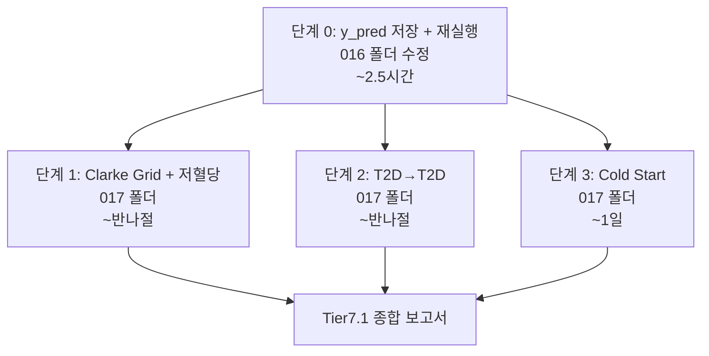

# Tier 7.1 후속 연구 구현 계획 (ML Only)

> 모든 실험은 LightGBM + sklearn 수준에서 수행한다. 딥러닝은 사용하지 않는다.

---

## 폴더 구조

```
Glucose-ML-Project/
├── 016_Tier_7_Cross_Disease/          ← 기존 (변경: y_pred 저장 추가)
│   ├── tier7_experiment.py            ← 수정: .npz 저장 로직 추가
│   ├── tier7_config.py
│   ├── tier7_data_utils.py
│   ├── tier7_tradaboost.py
│   └── tier7_results/
│       ├── 5way_all_targets.csv
│       ├── 5way_*.png
│       └── predictions/               ← 신규: 원시 예측값
│           ├── ShanghaiT2DM/
│           │   ├── source_only.npz
│           │   ├── target_only.npz
│           │   ├── mixed.npz
│           │   ├── coral.npz
│           │   └── tradaboost.npz
│           ├── CITY/
│           │   └── (동일 구조)
│           └── Colas_2019/
│               └── (동일 구조)
│
└── 017_Tier_7.1_Clinical_Transfer/    ← 신규 폴더
    ├── tier71_config.py               ← 출력 경로, 분석 파라미터
    ├── tier71_clinical_safety.py      ← 단계 1: Clarke Grid + 저혈당
    ├── tier71_same_disease.py         ← 단계 2: T2D→T2D 전이
    ├── tier71_cold_start.py           ← 단계 3: N=1 개인화
    └── tier71_results/
        ├── clinical/                  ← 단계 1 출력
        ├── same_disease/              ← 단계 2 출력
        └── cold_start/               ← 단계 3 출력
```

---

## 단계 0: y_pred 저장 인프라 (016 수정)

#### [MODIFY] [tier7_experiment.py](file:///C:/Users/user/Documents/NPJ2/Glucose-ML-Project/016_Tier_7_Cross_Disease/tier7_experiment.py)

`run_group()`에서 각 모델 예측 후 `.npz` 저장 추가.

재실행 필요:
```
python 016_Tier_7_Cross_Disease/tier7_experiment.py --groups 15min
python 016_Tier_7_Cross_Disease/tier7_experiment.py --groups 5min
```

예상 소요: ~2.5시간

---

## 단계 1: 임상 안전성 분석

#### [NEW] 017_Tier_7.1_Clinical_Transfer/tier71_clinical_safety.py

**입력:** `016_Tier_7_Cross_Disease/tier7_results/predictions/{target}/{model}.npz`

### 출력물 상세

| 파일 | 형식 | 내용 |
|---|---|---|
| `clinical/clarke_grid_{target}.png` | PNG | 6개 모델의 Clarke Error Grid scatter plot (2×3 서브플롯) |
| `clinical/clarke_zones.csv` | CSV | 각 모델 × 타겟의 Zone A/B/C/D/E 비율 (%) |
| `clinical/hypo_analysis.csv` | CSV | 저혈당(<70) 구간: sensitivity, specificity, PPV, NPV |
| `clinical/range_rmse.csv` | CSV | 구간별 RMSE: <70 / 70-180 / 180-250 / >250 mg/dL |
| `clinical/clinical_summary.png` | PNG | 모델별 Zone A 비율 + 저혈당 sensitivity 비교 막대 그래프 |

**CSV 컬럼 예시 (`clarke_zones.csv`):**

```
target,model,zone_A_pct,zone_B_pct,zone_C_pct,zone_D_pct,zone_E_pct,n_samples
ShanghaiT2DM,source_only,85.2,10.3,2.1,1.8,0.6,19932
ShanghaiT2DM,target_only,87.1,9.5,1.6,1.3,0.5,19932
...
```

**CSV 컬럼 예시 (`hypo_analysis.csv`):**

```
target,model,hypo_sensitivity,hypo_specificity,hypo_ppv,hypo_npv,n_hypo_events,n_total
ShanghaiT2DM,source_only,0.62,0.95,0.31,0.99,487,19932
...
```

**CSV 컬럼 예시 (`range_rmse.csv`):**

```
target,model,rmse_below70,rmse_70_180,rmse_180_250,rmse_above250,n_below70,n_70_180,n_180_250,n_above250
ShanghaiT2DM,source_only,18.5,15.2,22.1,35.7,487,14201,4012,1232
...
```

---

## 단계 2: 동일 질병 전이 (T2D → T2D)

#### [NEW] 017_Tier_7.1_Clinical_Transfer/tier71_same_disease.py

**입력:** `003_Glucose-ML-collection/ShanghaiT2DM/` (환자 CSV 100개)

**설계:** ShanghaiT2DM 100명을 환자 단위 분할
- Source 50명 → T2D 학습 데이터 (기존 T1D 소스 역할)
- Target 50명 → train 35 / val 7 / test 8
- 기존 5-way 비교 동일 수행

### 출력물 상세

| 파일 | 형식 | 내용 |
|---|---|---|
| `same_disease/5way_intra_T2D.csv` | CSV | 5-way 비교 결과 (group, target, model, rmse, mae, mard) |
| `same_disease/5way_intra_T2D.png` | PNG | 5-way 막대 그래프 |
| `same_disease/predictions/{model}.npz` | NPZ | y_true, y_pred (Clarke Grid 분석용) |
| `same_disease/comparison.csv` | CSV | cross-disease(T1D→T2D) vs intra-disease(T2D→T2D) 비교 표 |
| `same_disease/comparison.png` | PNG | 두 실험의 5-way 결과 병렬 비교 차트 |

**CSV 컬럼 예시 (`comparison.csv`):**

```
experiment,model,rmse,mae,mard,beats_target_only
cross_disease_T1D_to_T2D,source_only,20.93,14.48,10.6,False
cross_disease_T1D_to_T2D,tradaboost,19.78,13.66,10.0,False
intra_disease_T2D_to_T2D,source_only,?,?,?,?
intra_disease_T2D_to_T2D,tradaboost,?,?,?,?
```

핵심 판별: `beats_target_only` 열이 intra-disease에서 `True`면 → 도메인 갭이 원인.

---

## 단계 3: N=1 Cold Start 개인화

#### [NEW] 017_Tier_7.1_Clinical_Transfer/tier71_cold_start.py

**입력:** `003_Glucose-ML-collection/{target}/` (환자별 CSV)

**설계:** Leave-One-Patient-Out × 축적 일수 변화

```
각 환자 p에 대해:
  각 D ∈ [1, 3, 7, 14] 일에 대해:
    personal_only: 환자 p의 처음 D일로만 학습
    population:    나머지 환자 전체로 학습 → p에 zero-shot 적용
    tradaboost:    나머지 환자(source) + 환자 p D일(target) → TrAdaBoost
    
    test: 환자 p의 D일 이후 전체 데이터
```

### 출력물 상세

| 파일 | 형식 | 내용 |
|---|---|---|
| `cold_start/cold_start_{target}.csv` | CSV | 환자별 × 일수별 × 모델별 RMSE/MAE/MARD |
| `cold_start/cold_start_curve_{target}.png` | PNG | X: 축적 일수, Y: RMSE 중앙값, 3개 곡선 + IQR 밴드 |
| `cold_start/cold_start_summary_{target}.csv` | CSV | 일수별 중앙값/평균/IQR 집계 |
| `cold_start/crossover_point_{target}.csv` | CSV | personal이 population을 넘는 교차점 일수 |

**CSV 컬럼 예시 (`cold_start_{target}.csv`):**

```
target,patient_id,days,model,rmse,mae,mard,n_train_windows,n_test_windows
ShanghaiT2DM,patient_001,1,personal_only,35.2,24.1,18.5,48,720
ShanghaiT2DM,patient_001,1,population,20.8,14.3,10.4,68000,720
ShanghaiT2DM,patient_001,1,tradaboost,19.5,13.1,9.8,68048,720
ShanghaiT2DM,patient_001,3,personal_only,25.1,17.2,13.1,144,624
...
```

**시각화 (`cold_start_curve_{target}.png`):**

```
Y축: RMSE (mg/dL)
X축: 축적 일수 [1, 3, 7, 14]

곡선:
  ── personal_only (빨강): D↑ 시 급격히 하강
  ── population (회색 점선): 일정 (D와 무관)
  ── tradaboost (청록): population과 personal 사이에서 최적

음영: IQR (25th~75th percentile)
교차점 표시: personal이 population을 넘는 지점
```

---

## 전체 출력물 요약

| 단계 | CSV 파일 | PNG 파일 | NPZ 파일 | 합계 |
|---|---|---|---|---|
| 0 (y_pred 저장) | 0 | 0 | 15 (5모델 × 3타겟) | 15 |
| 1 (임상 안전성) | 3 | 2 | 0 | 5 |
| 2 (동일 질병) | 2 | 2 | 5 | 9 |
| 3 (Cold Start) | 3/타겟 | 1/타겟 | 0 | 4~12 |

---

## 실행 순서



## Open Questions

> [!IMPORTANT]
> **Cold Start 범위:** ShanghaiT2DM(100명, ~30분)만 할지, CITY(153명)와 Colas_2019(208명)까지 포함할지?
> 3개 타겟 모두 포함하면 "질병 유형에 따라 cold start 전이 이익이 다른가?"에도 답할 수 있습니다.
