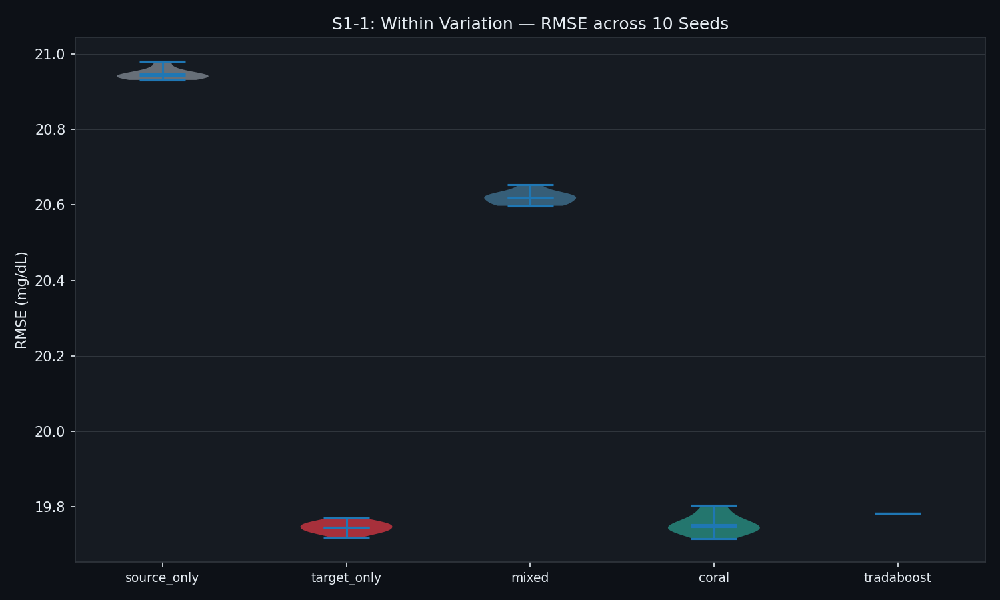
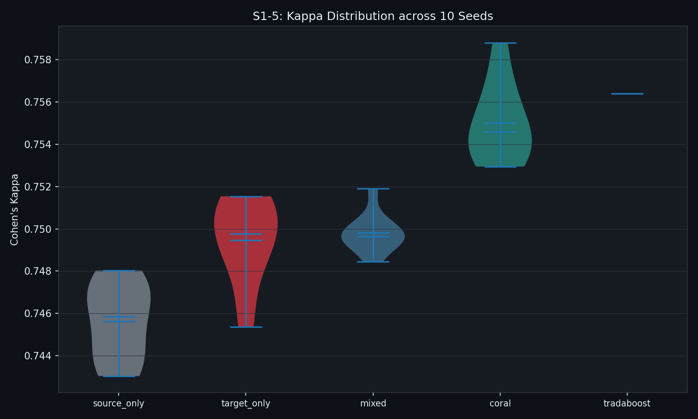
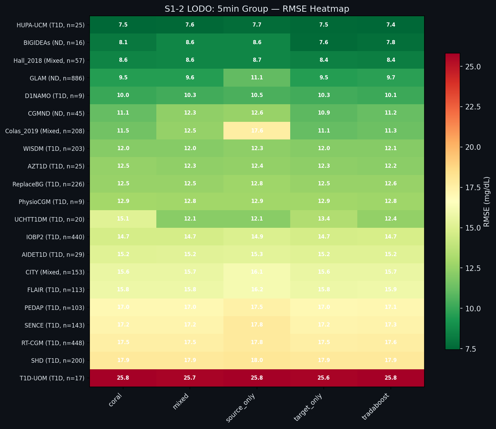
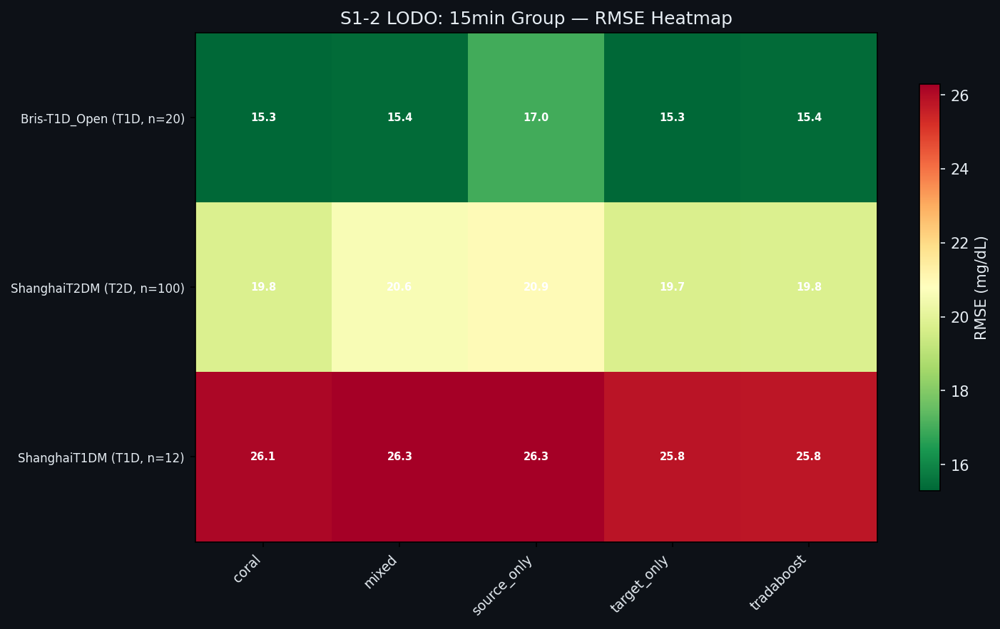
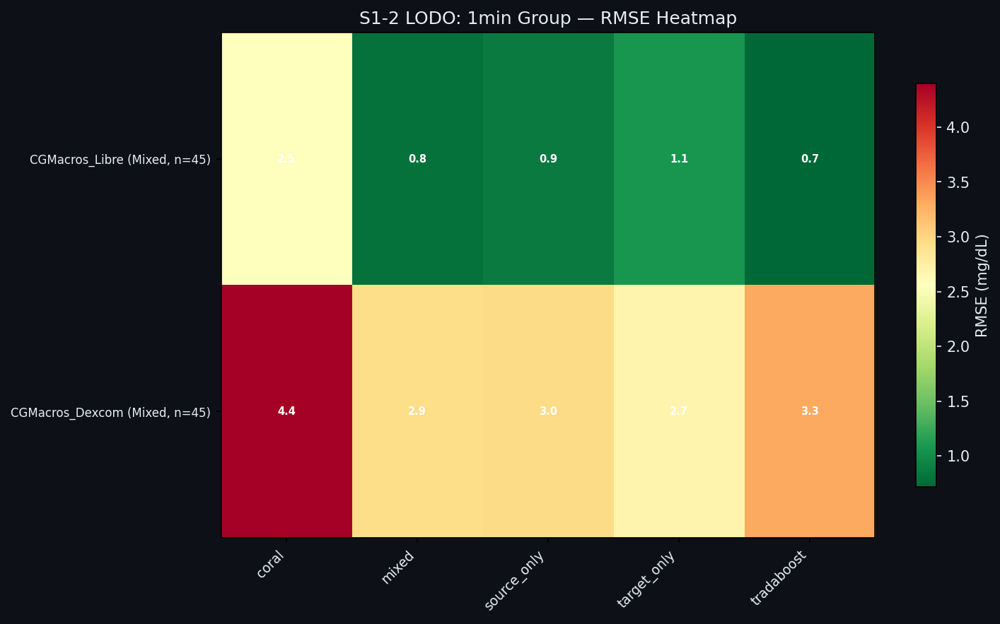
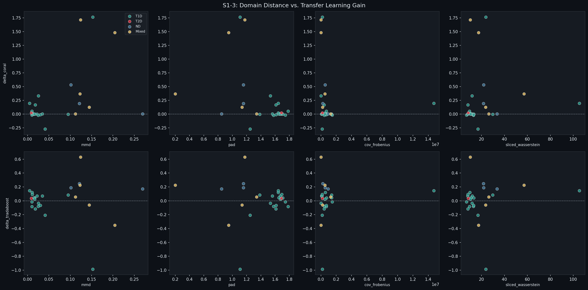
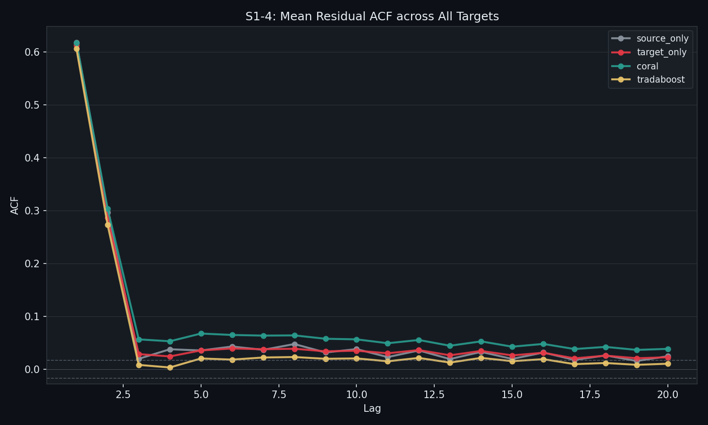
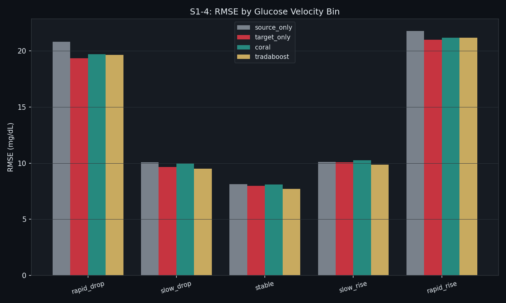

# Stage 1 시각화 설명 문서

본 문서는 019_Stage_1_Results/figures/ 폴더에 포함된 8개 시각화 파일 각각의 생성 목적, 읽는 방법, 그리고 핵심 관찰 사항을 기술한다. 모든 그림은 Stage 1 잔여 실험(S1-1 ~ S1-4)의 결과물이며, 그림만으로도 각 실험의 결론을 파악할 수 있도록 작성되었다.

---

## Fig 1. violin_rmse.png — S1-1: RMSE 분포 (10 시드)

**출처**: S1-1 Within Variation 실험  
**데이터**: 고정 데이터(소스 = T1D 15분 그룹, 타겟 = ShanghaiT2DM), 10개 난수 시드

**그림 설명**

바이올린 플롯은 5개 모델(source_only, target_only, mixed, coral, tradaboost)의 RMSE 분포를 10개 시드에 걸쳐 보여준다. 바이올린의 너비는 해당 값에서의 분포 밀도를 나타내고, 내부 수평선은 평균과 중앙값을 표시한다.

**읽는 방법**

- 세로 위치(Y축): RMSE 값이 낮을수록 좋다.
- 바이올린 너비: 좁을수록 시드 간 변동이 작고 결과가 안정적임을 의미한다.
- 바이올린의 위아래 폭: 10개 시드에서의 최소~최대 범위이다.

**핵심 관찰**

모든 모델의 바이올린이 매우 납작한 형태를 보인다. 이는 10개 시드에 걸친 변동이 극히 작음(CV < 0.2%)을 의미하며, 선행 실험의 결론이 특정 시드에 의한 우연이 아님을 확인한다. target_only와 coral이 가장 낮은 RMSE 대역(약 19.75 mg/dL)에 위치하며, source_only와 mixed가 더 높은 대역(약 20.6~20.9 mg/dL)에 분리되어 있다. tradaboost는 모든 시드에서 동일한 값(0.000 표준편차)을 보이는 점이 특징적이다.

---

## Fig 2. violin_kappa.png — S1-5: Cohen's Kappa 분포 (10 시드)

**출처**: S1-5 3분류 전환 분석  
**데이터**: S1-1과 동일한 예측값을 저혈당(< 70 mg/dL) / 정상(70~180) / 고혈당(> 180) 3분류로 이산화

**그림 설명**

회귀 예측값을 3분류로 변환한 후 Cohen's Kappa를 계산하여, 임상적 분류 관점에서의 모델 간 차이를 시각화한다. Kappa가 높을수록 분류 일치도가 높다.

**읽는 방법**

- Y축 범위가 0.743~0.759로 매우 좁다. 회귀 RMSE에서 나타난 모델 간 차이가 분류 지표에서는 더욱 미미해진다.
- Fig 1과 달리 바이올린 형태가 더 다양하여, 분류 지표에서는 시드 간 변동이 상대적으로 크다.

**핵심 관찰**

tradaboost(0.756)와 coral(0.755)이 가장 높고, target_only(0.749), mixed(0.750), source_only(0.746) 순이다. 그러나 모든 모델 간 Kappa 차이가 최대 0.010에 불과하여 임상적으로 의미 있는 수준의 차이라고 보기 어렵다. 전이학습이 회귀 성능에서 유의미한 개선을 보이지 못하는 것과 마찬가지로, 임상 분류 성능에서도 동등한 수준에 머문다.

---

## Fig 3. heatmap_5min.png — S1-2 LODO: 5분 그룹 RMSE 히트맵

**출처**: S1-2 LODO 실험  
**데이터**: 5분 그룹 21개 데이터셋, 4개 모델(coral, mixed, source_only, target_only, tradaboost)

**그림 설명**

행은 타겟 데이터셋(Target-Only RMSE 오름차순 정렬), 열은 모델을 나타낸다. 각 셀의 색상과 숫자는 해당 타겟-모델 조합의 RMSE(mg/dL)를 표시한다. 녹색이 낮은 RMSE(우수), 적색이 높은 RMSE(불량)이다. 행 라벨에 질환 유형과 피험자 수가 병기되어 있다.

**읽는 방법**

- 각 행에서 어느 열(모델)이 가장 짙은 녹색인지를 보면, 해당 타겟에서 최선의 모델을 파악할 수 있다.
- 행 전체가 균등한 색상이면 모든 모델의 성능 차이가 작음을 의미한다.
- 특정 셀만 현저히 밝거나(노랗거나) 붉으면, 그 모델이 해당 타겟에서 특별히 불량함을 의미한다.

**핵심 관찰**

대부분의 행에서 모든 모델 간 색상 차이가 미미하다. target_only 열이 거의 대부분의 행에서 가장 짙은 녹색이거나 동등하다. 눈에 띄는 예외로 UCHTT1DM 행의 coral 셀(15.1, 밝은 황록색)이 다른 모델(12.1~13.4)보다 현저히 높아 CORAL이 크게 악화된 사례이다. Colas_2019의 source_only 셀(17.6, 황색)도 다른 모델(11.1~12.5)보다 크게 높아, 소스 데이터만으로는 학습이 불충분한 사례를 보여준다.

---

## Fig 4. heatmap_15min.png — S1-2 LODO: 15분 그룹 RMSE 히트맵

**출처**: S1-2 LODO 실험  
**데이터**: 15분 그룹 3개 데이터셋(Bris-T1D_Open, ShanghaiT1DM, ShanghaiT2DM)

**그림 설명**

5분 그룹 히트맵과 동일한 방식으로 표현된다. 15분 그룹은 3개 데이터셋만 존재하므로, LODO 시 소스 풀이 2개 데이터셋으로 제한된다.

**핵심 관찰**

세 타겟 데이터셋의 RMSE 수준이 서로 크게 다르다. Bris-T1D_Open(15.3 mg/dL 수준), ShanghaiT2DM(19.7~20.9), ShanghaiT1DM(25.8~26.3)으로, 피험자 수가 적은(12명) ShanghaiT1DM에서 전반적 RMSE가 높다. ShanghaiT1DM에서는 모든 모델이 붉은색(25~26 mg/dL)으로 나타나며, 소규모 코호트에서의 예측 난이도가 높음을 시각적으로 보여준다. ShanghaiT2DM 행에서 source_only와 mixed가 target_only보다 현저히 밝은(더 높은 RMSE) 것은, T1D 소스 데이터가 T2D 타겟에 부정적으로 작용함을 나타낸다.

---

## Fig 5. heatmap_1min.png — S1-2 LODO: 1분 그룹 RMSE 히트맵

**출처**: S1-2 LODO 실험  
**데이터**: 1분 그룹 2개 데이터셋(CGMacros_Dexcom, CGMacros_Libre)

**그림 설명**

1분 그룹은 2개 데이터셋 간 교차 전이로, 소스 풀이 1개 데이터셋뿐이다. RMSE 스케일이 0.7~4.4 mg/dL로, 5분/15분 그룹보다 훨씬 낮다. 이는 1분 예측 시간 간격(3스텝 = 3분 뒤 예측)이 15분 예측(3스텝 = 45분 뒤)보다 훨씬 쉬운 태스크임을 반영한다.

**핵심 관찰**

CGMacros_Dexcom 행의 coral 셀(4.4, 진적색)이 다른 모델(2.7~3.3)보다 훨씬 높다. 이는 CORAL이 Dexcom(5분 원본 → 1분 보간)과 Libre(15분 원본 → 1분 보간)의 서로 다른 보간 아티팩트로 인해 공분산 구조 정렬에 실패한 결과로 해석된다. CGMacros_Libre 행에서는 coral 셀(3.5, 황색)이 다른 모델(0.7~1.1, 진녹색)보다 훨씬 높아, 동일한 현상이 반대 방향 전이에서도 나타남을 보여준다.

---

## Fig 6. scatter_distance_vs_delta.png — S1-3: 도메인 거리 vs. 전이학습 이득

**출처**: S1-3 도메인 거리 분석  
**데이터**: 26개 타겟 데이터셋 각각의 도메인 거리 지표(MMD, PAD, Cov Frobenius, SWD)와 Delta RMSE(전이학습 RMSE - Target-Only RMSE)

**그림 설명**

2행 4열의 서브플롯으로 구성된다. 상단 행은 Delta CORAL(y축)을, 하단 행은 Delta TrAdaBoost(y축)를 나타낸다. x축은 4가지 도메인 거리 지표(MMD, PAD, Cov Frobenius, SWD)이다. 각 점은 하나의 타겟 데이터셋을 나타내며, 색상은 질환 유형(청록=T1D, 빨강=T2D, 파랑=ND, 노랑=Mixed)을 구분한다. 점이 y=0 기준선보다 위에 있으면 전이학습이 Target-Only보다 나쁘고, 아래에 있으면 전이학습이 더 좋다.

**읽는 방법**

- 상관 패턴이 있으면(점들이 기울어진 방향으로 모임) 해당 거리 지표가 전이학습 성능을 예측한다.
- 점들이 y=0 주변에 무작위로 흩어져 있으면 거리 지표와 성능 간 연관성이 없다.

**핵심 관찰**

상단 행(Delta CORAL)에서 MMD x축 방향으로 점들이 우상향하는 경향이 보인다(상관 r=0.504, p=0.009). 도메인 거리(MMD)가 클수록 CORAL의 성능 하락이 커진다. 반면 하단 행(Delta TrAdaBoost)에서는 어떤 거리 지표에서도 뚜렷한 패턴이 없으며 점들이 y=0 근방에 무작위로 분포한다. 이는 TrAdaBoost의 성능이 도메인 거리와 무관함을 의미한다. 대부분의 점이 y=0 위에 위치하여(전이학습이 더 나쁜 방향) 전이학습의 전반적 불리함을 시각적으로 확인할 수 있다.

---

## Fig 7. acf_mean_all_models.png — S1-4: 잔차 자기상관함수 (26개 타겟 평균)

**출처**: S1-4 시계열 한계 분석  
**데이터**: 26개 타겟 데이터셋의 잔차(y_true - y_pred) ACF를 4개 모델에 대해 lag 1~20 계산 후 평균

**그림 설명**

x축은 시간 지연(lag, 1스텝 = 측정 주기), y축은 자기상관계수(ACF)이다. 4개 모델이 서로 다른 색상으로 표시된다. 수평 점선은 95% 신뢰구간 경계로, 이 선 밖의 ACF는 통계적으로 유의미한 자기상관을 의미한다.

**읽는 방법**

- 이상적인 모델(백색 잡음 잔차)이라면 모든 lag에서 ACF가 신뢰구간 내에 위치해야 한다.
- ACF가 신뢰구간 밖에 있으면 잔차에 시간적 패턴이 남아있어 모델이 해당 정보를 포착하지 못했음을 의미한다.

**핵심 관찰**

lag=1에서 4개 모델 모두 ACF 0.60~0.62로 신뢰구간을 크게 초과한다. 이후 lag=2에서 급격히 감소(0.27~0.30)하고, lag=3부터는 신뢰구간 근방 또는 내부로 수렴한다. 4개 모델의 선이 lag=1에서 거의 겹쳐 있다는 것이 핵심이다. CORAL과 TrAdaBoost를 적용해도 잔차의 시간적 자기상관이 해소되지 않는다. lag=1 하나에서의 ACF 0.61은, 연속된 예측 오차의 61%가 이전 오차와 같은 방향인 "관성"이 존재함을 의미한다.

---

## Fig 8. velocity_rmse_bars.png — S1-4: 혈당 변화 속도별 RMSE

**출처**: S1-4 시계열 한계 분석  
**데이터**: 잔차에서 직전 혈당 변화 속도(velocity = y[t] - y[t-1])를 5구간으로 분류하고, 각 구간별 RMSE를 26개 타겟 평균으로 계산

**그림 설명**

x축은 5가지 혈당 변화 속도 구간이다:
- rapid_drop: -5 mg/dL/step 미만 (급격한 저하)
- slow_drop: -5 ~ -1
- stable: -1 ~ +1 (안정)
- slow_rise: +1 ~ +5
- rapid_rise: +5 mg/dL/step 초과 (급격한 상승)

각 구간에서 4개 모델의 막대가 나란히 표시된다.

**읽는 방법**

- stable 구간의 막대를 기준값으로 삼아 다른 구간의 막대 높이 비율을 비교한다.
- 4개 모델의 막대 높이가 각 구간에서 유사하면, 특정 모델이 특정 속도 구간에서 우위를 갖지 않는다.

**핵심 관찰**

stable 구간(약 8 mg/dL)에 비해 rapid_drop과 rapid_rise 구간에서 RMSE가 약 19~21 mg/dL로 2.5배 이상 증가한다. 이 패턴이 4개 모델 전부에서 동일하게 나타난다. 즉 CORAL이나 TrAdaBoost도 급격한 혈당 변화 구간에서의 성능 저하를 개선하지 못한다. 이는 정적 모델이 혈당의 추세(방향성, 가속도)를 학습하지 못한다는 구조적 한계를 직접적으로 보여주며, 시계열 아키텍처로의 전환 필요성을 지지하는 핵심 근거이다.
