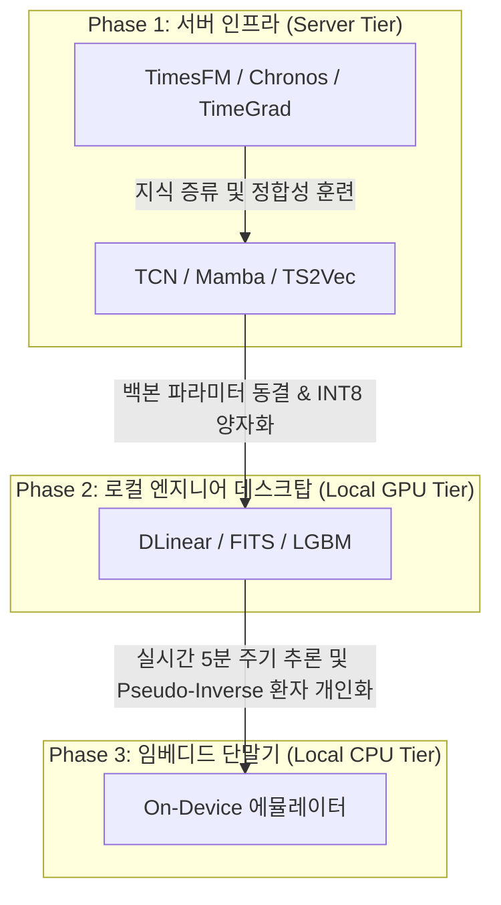

# Resource-Gated Model Tiers for Glucose-ML

본 문서는 수집 및 분석된 95편의 시계열 모델들을 자원 수준(로컬 CPU, 로컬 GPU, 서버급 GPU)에 따라 분류하고, 각 자원별 가용성 및 프로젝트 적용 방안을 제시하는 보고서입니다.

---

## 1. 자원별 가용 모델 분류 매트릭스

| 자원 수준 (Compute Tier) | 대상 아키텍처 계열 | 주요 가용 모델 예시 | 권장 하드웨어 사양 | 온디바이스(Edge) 가용성 |
|---|---|---|---|---|
| **Tier 1: 로컬 PC CPU** | - 통계 및 머신러닝 - 선형 및 MLP 계열 | ARIMA, LightGBM, XGBoost, CatBoost, DLinear, N-BEATS, N-HiTS, TSMixer, TiDE, FITS, PatchMLP, XLinear, SOFTS, RAM | Dual-Core CPU RAM 4GB 이상 | **상 (High)** - 실시간 5분 주기 루프 탑재 가능 - TFLite / C++ 사전 빌드 최적 |
| **Tier 2: 로컬 PC GPU** | - TCN & CNN 계열 - 경량 Mamba - 중소형 하이브리드 | TCN, ModernTCN, TimesNet, SCINet, PatchMixer, EffiCANet, ACNet, TAEGCN, TS2Vec, CoST, FCN, InceptionTime, ms-Mamba, SOR-Mamba, FMamba, Mamba-ProbTSF, NeuralProphet, DeepAR | Consumer GPU (RTX 3060/4060) RAM 16GB 이상 | **중 (Medium)** - 동결(Frozen) 상태로 추론 가동 가능 - 실시간 학습은 불가 (오프라인 배포) |
| **Tier 3: 서버급 PC GPU** | - 대형 파운데이션 모델 - 확산(Diffusion) 모델 - 연속 시간 ODE 모델 | TimesFM, Chronos, MOIRAI (오리지널), Lag-Llama (오리지널), TimeGrad, TimeGAN, Latent ODE, STG-Mamba | Enterprise GPU (A100/H100/L40S) VRAM 16GB~80GB | **하 (Low)** - 단독 탑재 불가능 - 경량 학생 모델(MLP/TCN)로의 지식 증류 필수 |

---

## 2. 세부 티어별 분석 및 가용 모델 목록

### 2.1 Tier 1: 로컬 PC CPU (온디바이스 최적화 모형군)
실시간 Edge 추론(5분 주기) 및 초경량 단말 맞춤형 개인화에 적합한 가볍고 빠른 모형군입니다.

* **파라미터 스케일**: 10K ~ 1M 이하
* **메모리 점유율**: 10MB 이하
* **추론 지연 시간**: CPU 기준 5ms 이하
* **주요 모델 목록**:
  * **통계/부스팅**: ARIMA, LightGBM (Paper 86), XGBoost (Paper 87), CatBoost (Paper 88)
  * **선형/MLP**: DLinear (Paper 17), N-BEATS (Paper 18), N-HiTS (Paper 19), TSMixer (Paper 20), TiDE (Paper 21), LightTS (Paper 22), FreTS (Paper 23), MoLE (Paper 24), FITS (Paper 66), PatchMLP (Paper 67), XLinear (Paper 68), SOFTS (Paper 69), RAM (Paper 71), TSKANMixer (Paper 74)
* **Glucose-ML 적용성**:
  * **온디바이스 개인화**: FITS나 DLinear, TSMixer와 같은 초경량 MLP 계열은 closed-form 대수 방정식(Moore-Penrose Pseudo-Inverse 또는 Ridge Regression)을 사용하여 백프로퍼게이션 없이 단 1회의 행렬 곱으로 환자별 개인화 튜닝을 달성할 수 있습니다.
  * **머신러닝 테이블화**: LightGBM/XGBoost는 단말에 사전 컴파일된 C++ 배열 또는 Decision Tree 코드로 탑재되어 CPU 자원 고갈 없이 최고 속도의 연산을 지원합니다.

---

### 2.2 Tier 2: 로컬 PC GPU (엔지니어 데스크탑 개발 및 학습 가능 모형군)
병렬 연산이 가능하지만 메모리 및 모델 구조가 중소형(Middle-scale)에 최적화되어, 일반 상용 그래픽카드 1장으로도 학습 및 갱신이 가능한 모형군입니다.

* **파라미터 스케일**: 1M ~ 15M 이하
* **메모리 점유율**: 50MB ~ 200MB 내외
* **추론 지연 시간**: GPU 기준 2ms 이하, 로컬 CPU 기준 10ms ~ 50ms 내외
* **주요 모델 목록**:
  * **합성곱/TCN**: TCN (Paper 81), ModernTCN (Paper 76), TimesNet (Paper 30), SCINet (Paper 29), PatchMixer (Paper 77), EffiCANet (Paper 78), ACNet (Paper 79), TAEGCN (Paper 80), FCN (Paper 84), InceptionTime (Paper 85)
  * **대조 학습/표상 임베딩**: TS2Vec (Paper 82), CoST (Paper 83)
  * **SSM/Mamba**: ms-Mamba (Paper 51), Mamba-ProbTSF (Paper 52), SOR-Mamba (Paper 53), FMamba (Paper 55)
  * **중소형 하이브리드**: NeuralProphet (Paper 89), DeepAR (Paper 90), DeepGB (Paper 93), Hyper-Trees (Paper 94)
* **Glucose-ML 적용성**:
  * **오프라인 학습 - 온디바이스 추론**: 로컬 PC GPU를 통해 환자 코호트 전체 데이터로 백본 CNN/Mamba를 학습시킵니다. 학습이 끝나면 신경망의 가중치를 동결(Frozen Weight)하고, TFLite 형태로 양자화(INT8)하여 단말 CPU에 배포합니다.
  * **12시간 링 버퍼 매핑**: 단말 CPU 단독으로는 이력 윈도우 팽창(Dilation) 연산 및 SSM 스캔 연산이 오버헤드를 유발하므로, 12시간 링 버퍼를 활용해 배치 단위로 이력 특징을 간헐적으로 인코딩하는 우회 설계를 수용할 수 있습니다.

---

### 2.3 Tier 3: 서버급 PC GPU (엔터프라이즈 서버 인프라 모형군)
자체 훈련 및 추론을 위해 고대역폭 메모리(HBM)와 서버급 컴퓨팅 하드웨어가 필수적인 대형 파운데이션 모델 및 생성형 모형군입니다.

* **파라미터 스케일**: 20M ~ 수억 개 (100M+ Scale)
* **메모리 점유율**: 500MB ~ 수 GB 이상
* **추론 지연 시간**: CPU 기준 500ms 이상 (실시간 제어 불가), 서버 GPU 기준 20ms ~ 100ms
* **주요 모델 목록**:
  * **시계열 파운데이션 모델 (TSFM)**: TimesFM (Paper 56), Chronos (Paper 57), MOIRAI (Paper 58), Lag-Llama (Paper 59)
  * **연속 시간/확산 모델**: TimeGrad (Paper 91), Latent ODE (Paper 92)
  * **생성형 적대 신경망**: TimeGAN (Paper 92)
  * **대규모 시공간 그래프**: STG-Mamba (Paper 54)
* **Glucose-ML 적용성**:
  * **지식 증류(Knowledge Distillation)**: 서버급 GPU 상에서 대형 파운데이션 모델(TimesFM, Chronos)이나 확산 모델(TimeGrad)을 구동하여 미관측 가상 시나리오의 고정밀 혈당 반응 분포를 다량 에뮬레이션합니다. 이를 교사(Teacher) 데이터로 삼아 로컬 CPU용 TSMixer나 TCN 학생(Student) 모델을 지도 학습시킵니다.
  * **클라우드 API 예측**: 로컬 장치에 탑재하지 않고, 중앙 의료 서버에 API 형태로 모델을 배치하여 24시간 장기 혈당 흐름 및 인슐린 가이드라인을 백그라운드로 전송받는 시스템에 활용합니다.

---

## 3. Glucose-ML 연구개발 단계별 자원 매핑 전략

### 3.1 단기 구현 전략 (Local CPU)
* **모델 선택**: DLinear, XGBoost, TSMixer
* **설계 특징**: 단말 메모리에 최근 12시간 이력을 캐싱하되, 실시간 L=3 입력을 Causal MLP를 거쳐 즉시 결합합니다. 온디바이스에서 추가적인 역전파 연산을 완전히 차단합니다.

### 3.2 중기 고성능 확장 전략 (Local GPU)
* **모델 선택**: TCN, ModernTCN, SOR-Mamba
* **설계 특징**: TFLite 컴파일 시 표준 Convolution 연산자만 남기고 Spatial Dropout 이나 Complex Fourier Layer는 실수형 MLP/Normal Dropout으로 우회 정합하여 Edge 가속을 활성화합니다.
