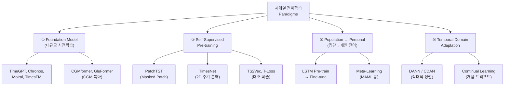

# 연속 시계열 전이학습 문헌 조사 보고서
**— 기존 방법론의 한계 진단 및 시계열 특화 전이학습 패러다임 탐색 —**

---

## Part 1: 기존 프로젝트에서 사용한 전이학습 방법론은 실제로 '정적/분류 중심'인가?

> [!IMPORTANT]
> **결론: 맞습니다.** 코드 및 문서 분석 결과, Tier 4~7.1에서 사용한 모든 전이학습 기법은 원래 **정적(i.i.d.) 분류/회귀 문제**를 위해 설계된 것이며, 시계열의 시간적 구조를 활용하지 않습니다.

### 1.1 기법별 원본 논문 및 설계 의도 분석

| 기법 | 원본 논문 | 원래 설계된 문제 유형 | 시계열 인식 여부 |
|:---|:---|:---|:---|
| **CORAL** | Sun et al. (2016) "Return of Frustratingly Easy Domain Adaptation", AAAI | 이미지 분류의 도메인 적응 (Office dataset 등) | ❌ 없음 |
| **TCA** | Pan et al. (2011) "Domain Adaptation via Transfer Component Analysis", IEEE TNN | 텍스트 분류, 감정 분석, 이미지 분류 | ❌ 없음 |
| **TrAdaBoost** | Dai et al. (2007) "Boosting for Transfer Learning", ICML | 텍스트 분류 (20 Newsgroups 등) | ❌ 없음 |
| **LightGBM Pre-train → Fine-tune** | — (일반적 전이학습 패턴) | 테이블형(tabular) 데이터의 지도 학습 | ❌ 없음 |
| **2-Stage Residual (Nalmpatian)** | Nalmpatian et al. (2025) PLOS ONE | 국가별 사망률 예측 (정적 cross-sectional 데이터) | ❌ 없음 |

### 1.2 코드 기반 근거

#### CORAL ([tier6_transfer_utils.py](file:///c:/Users/11015/Documents/NPJ2/Glucose-ML-Project/013_Tier_6_Domain_Adaptation/tier6_transfer_utils.py))

```python
# 공분산 정렬: 모든 데이터 포인트를 '독립된 행'으로 취급
cs = np.cov(source_x, rowvar=False)   # 시간 순서 무시
ct = np.cov(target_x, rowvar=False)   # 시간 순서 무시
```

- **문제점**: 시계열 윈도우를 개별 행(row)으로 펼쳐서 공분산을 계산. 시간 t와 t+1 사이의 자기상관(autocorrelation), 추세(trend), 계절성(seasonality)을 전혀 반영하지 않음.

#### TCA ([tier6_transfer_utils.py](file:///c:/Users/11015/Documents/NPJ2/Glucose-ML-Project/013_Tier_6_Domain_Adaptation/tier6_transfer_utils.py#L52-L108))

```python
# MMD 최소화: 데이터를 '집합(set)'으로 취급
e = np.vstack([1.0/ns * np.ones((ns, 1)), -1.0/nt * np.ones((nt, 1))])
L = np.dot(e, e.T)   # 시간 의존성 없는 정적 커널 매트릭스
```

- **문제점**: 커널 힐베르트 공간(RKHS) 투영 시 시간 축의 순서 정보가 완전히 소실됨. 데이터를 셔플해도 동일한 결과가 나옴.

#### TrAdaBoost ([tier7_tradaboost.py](file:///c:/Users/11015/Documents/NPJ2/Glucose-ML-Project/016_Tier_7_Cross_Disease/tier7_tradaboost.py))

```python
# 인스턴스 재가중: 각 윈도우를 독립 샘플로 취급
w_src = w_src * (beta ** norm_src)    # 시간 위치 정보 없이 오차 기반 가중치만 조정
```

- **문제점**: 인스턴스 기반 재가중(instance reweighting)은 각 데이터 포인트를 **교환 가능(exchangeable)**하다고 가정. 시계열에서 특정 시간대(예: 새벽 vs. 식후)의 맥락적 중요성을 반영하지 못함.

#### LightGBM Pre-train/Fine-tune (전체 파이프라인)

```
Source 데이터 → LightGBM 학습 → init_score로 Target에 전달 → 잔차 학습
```

- **문제점**: LightGBM 자체가 시계열을 **각 시점의 피처 벡터를 독립 행으로** 처리하는 구조. `glucose[t-5], glucose[t-4], ..., glucose[t]`를 독립 변수 5개로 넣지만, 이것이 **연속된 궤적**이라는 정보는 모델에 인코딩되지 않음.

### 1.3 요약: 왜 이것이 문제인가?

```
┌─────────────────────────────────────────────────────────────────┐
│     기존 방법론들이 시계열 데이터를 처리하는 방식                    │
├─────────────────────────────────────────────────────────────────┤
│                                                                 │
│  원본 CGM 시계열:   ──●──●──●──●──●──●──●──●──●──●──           │
│                      t-9 t-8 t-7 t-6 t-5 t-4 t-3 t-2 t-1 t     │
│                                                                 │
│  기존 처리 방식:    [●, ●, ●, ●, ●, ●, ●, ●, ●, ●]  ← 1D 벡터  │
│                     시간 순서 = 그냥 피처 인덱스                    │
│                     자기상관 = 무시                                │
│                     추세/주기 = 수동 피처로만 보상                  │
│                                                                 │
│  시계열 특화 방식:  ──●──●──●──●──●──● → LSTM/Transformer →       │
│                     hidden states가 시간 흐름을 연속적으로 인코딩    │
│                     자기상관 = 구조적으로 학습                      │
│                     추세/주기 = 어텐션/게이트가 자동 포착            │
└─────────────────────────────────────────────────────────────────┘
```

> [!NOTE]
> 기존 방법이 *완전히 무효*인 것은 아닙니다. Velocity, SD1, 사인/코사인 위상 등의 **수동 피처 공학**으로 시계열 정보를 부분적으로 보상했고, 실제로 성능 향상을 확인했습니다. 그러나 이는 시계열 구조를 **모델이 직접 학습**하는 것이 아닌, 인간이 **사전에 설계하여 주입**한 것입니다.

---

## Part 2: 연속 시계열에 특화된 전이학습 문헌 조사

### 2.1 패러다임 분류 체계

연속 시계열 전이학습은 크게 **4가지 패러다임**으로 분류할 수 있습니다:



---

### 2.2 패러다임 ①: 시계열 파운데이션 모델 (Foundation Models)

NLP의 GPT/BERT 패러다임을 시계열에 적용한 대규모 사전학습 모델입니다.

#### 2.2.1 범용 시계열 파운데이션 모델

| 모델 | 개발처 | 아키텍처 | 핵심 특징 | 논문 |
|:---|:---|:---|:---|:---|
| **TimeGPT** | Nixtla | Transformer (독점) | API 기반 zero-shot 예측 | Garza & Mergenthaler-Canseco (2023) |
| **Chronos** | Amazon | T5 기반 Enc-Dec | 수치 → 이산 토큰 변환, 언어 모델식 학습 | Ansari et al. (2024), arXiv:2403.07815 |
| **Moirai** | Salesforce | Any-variate Attention | 다변량 + 불규칙 타임스탬프 네이티브 지원 | Woo et al. (2024), arXiv:2402.02592 |
| **TimesFM** | Google | Decoder-only + Patch | 엔터프라이즈급 확장성, 사전학습 후 zero-shot | Das et al. (2024), arXiv:2310.10688 |
| **Lag-Llama** | ServiceNow | Decoder-only (Llama 계열) | 확률적 예측 + 래그 피처 입력 | Rasul et al. (2024), arXiv:2310.08278 |
| **PatchTST** | Princeton | Transformer Encoder + Patch | 마스킹 패치 재구성으로 자기지도 사전학습 | Nie et al. (2023), ICLR 2023 |

> [!TIP]
> **프로젝트 적용 가능성**: Chronos나 TimesFM으로 CGM 시계열을 zero-shot 예측하거나, PatchTST를 multi-source CGM 데이터에 사전학습 후 타겟 데이터셋에 fine-tune하는 방식이 유망합니다.

#### 2.2.2 CGM/혈당 특화 파운데이션 모델

| 모델 | 사전학습 규모 | 아키텍처 | 다운스트림 태스크 | 논문 |
|:---|:---|:---|:---|:---|
| **CGMformer** | 대규모 CGM 코호트 | Transformer Encoder (Masked Learning) | 당뇨 스크리닝, 대사 서브타이핑, 결측치 보간 | Yang et al. (2024), Nature Metabolism 계열 |
| **GluFormer** (Foundation) | 10,812명 / 1,000만+ 측정치 | Transformer (Next-token Prediction) | 위험 층화, 합성 데이터 생성, 결측치 보간 | Motzkin et al. (2024), arXiv:2408.11876 |
| **Gluformer** (Uncertainty) | 벤치마크 CGM | Transformer | 개인화 예측 + 불확실성 정량화 (무한 혼합 분포) | Sergazinov et al. (2022), arXiv:2209.04526 |

> [!IMPORTANT]
> **CGMformer**와 **GluFormer**는 본 프로젝트의 CGM 예측 문제에 **직접적으로 관련된** 시계열 전이학습 파운데이션 모델입니다. 특히 GluFormer는 10,000명 이상의 데이터에서 사전학습하여 개별 환자의 대사 상태를 잠재 벡터로 인코딩하는 방식으로, Tier 5의 2-Stage Residual 접근법과 철학적으로 유사하면서도 시계열 구조를 네이티브로 활용합니다.

---

### 2.3 패러다임 ②: 자기지도 시계열 표현 학습 (Self-Supervised Pre-training)

레이블 없이 시계열의 구조적 패턴을 학습하여 전이 가능한 표현(representation)을 추출합니다.

| 방법론 | 학습 목표 | 핵심 기법 | 논문 |
|:---|:---|:---|:---|
| **PatchTST** | 마스킹된 패치 재구성 | 시계열을 서브시리즈 패치로 분할 → 일부 마스킹 → 재구성 학습 | Nie et al. (2023), ICLR 2023 |
| **TS2Vec** | 계층적 대조 학습 | 다중 스케일에서 시간-인스턴스 대조 손실 | Yue et al. (2022), AAAI 2022 |
| **T-Loss** | 트리플렛 시간 대조 학습 | 시간적 근접성 기반 positive/negative 샘플링 | Franceschi et al. (2019), NeurIPS 2019 |
| **TimesNet** | 다주기 2D 변환 | 1D 시계열 → FFT 기반 주기 분해 → 2D 텐서로 변환 → InceptionBlock | Wu et al. (2023), ICLR 2023 |
| **GPT4TS** | LLM 적응 | 사전학습 LLM (GPT-2) 동결 → 패치 임베딩으로 시계열 입력 | Zhou et al. (2023) |

> [!NOTE]
> **TS2Vec**과 **T-Loss**는 시계열의 **시간적 인접성(temporal proximity)**을 명시적으로 활용하는 대조 학습입니다. 가까운 시점의 표현은 유사하게, 먼 시점의 표현은 다르게 학습하여, 시계열 고유의 연속성을 인코딩합니다. 이는 CORAL/TCA가 시간 순서를 무시하는 것과 **근본적으로 다른 접근**입니다.

---

### 2.4 패러다임 ③: 집단 → 개인 전이 (Population-to-Personal Transfer)

CGM/혈당 예측 도메인에서 가장 활발하게 연구되는 실용적 전이학습 패턴입니다.

| 접근법 | 메커니즘 | 관련 연구 |
|:---|:---|:---|
| **LSTM Pre-train → Fine-tune** | 대규모 인구 데이터로 LSTM 사전학습 → 개별 환자 데이터로 미세 조정 (학습률 감소) | Martinsson et al. (2020), Li et al. (2021) 등 다수 |
| **Shared + Personalized Layers** | 공유 레이어(일반적 혈당 역학) + 환자별 레이어(개인 특이적 반응) | Zhu et al. (2020) |
| **DTW 기반 유사 환자 선택** | Dynamic Time Warping으로 가장 유사한 혈당 패턴을 가진 소스 환자 선별 → 가중 전이 | Yin et al. (2022) |
| **Meta-Learning (MAML)** | MAML + LSTM-Transformer로 새 환자에 빠르게 적응하는 초기화 학습 | Mosquera-Lopez et al. (2023) |
| **Federated Learning** | 환자 데이터를 중앙 서버에 모으지 않고 로컬에서 학습 → 모델 파라미터만 공유 | Choudhary et al. (2024) |

> [!TIP]
> 본 프로젝트의 **Tier 4 (Multi-source LightGBM pooling)**과 가장 직접적으로 비교 가능한 패러다임입니다. 차이점은 이 문헌들은 LSTM/Transformer 등 **시계열 네이티브 아키텍처**를 사용하여, 시간적 의존성을 모델 구조 자체가 학습한다는 것입니다.

---

### 2.5 패러다임 ④: 시간적 도메인 적응 (Temporal Domain Adaptation)

기존 CORAL/TCA의 정적 분포 정렬을 시계열 맥락으로 확장한 방법론들입니다.

| 방법론 | 핵심 아이디어 | 기존 방법과의 차이 | 논문 |
|:---|:---|:---|:---|
| **VRADA** | Variational RNN + 적대적 도메인 정렬 | RNN이 시계열의 시간 구조를 보존하면서 도메인 불변 표현 학습 | Purushotham et al. (2017) |
| **CoDATS** | CNN + 적대적 정렬 + Weak Supervision | 시계열 분류를 위한 end-to-end 도메인 적응 | Wilson et al. (2020), arXiv:2005.10996 |
| **CLUDA** | 대조 학습 기반 시계열 비지도 도메인 적응 | 시간적 대조 손실로 소스-타겟 시계열 표현 정렬 | Ozyurt et al. (2023) |
| **RAINCOAT** | 시간-주파수 이중 도메인 정렬 | 시간 도메인과 주파수 도메인 모두에서 정렬 수행 | He et al. (2023) |
| **Continual Learning** | 개념 드리프트 대응 점진적 학습 | 정적 정렬이 아닌 시간에 따라 적응이 진화 | Pham et al. (2024) Survey |
| **Temporal Adapter** | 사전학습 모델에 시간적 어댑터 모듈 삽입 | 전체 모델 재학습 없이 시간 영역 특화 적응 | 다수 최신 연구 |

---

## Part 3: 기존 방법론 vs. 시계열 특화 방법론 비교 요약

| 차원 | 기존 프로젝트 (Tier 4~7.1) | 시계열 특화 전이학습 |
|:---|:---|:---|
| **시간 구조 인식** | ❌ 피처 벡터를 i.i.d. 행으로 취급 | ✅ RNN/Transformer가 시간 의존성을 구조적으로 학습 |
| **전이 단위** | 통계적 분포 정렬 (공분산, MMD) 또는 인스턴스 가중치 | 시계열 표현(representation) 자체의 전이 |
| **개념 드리프트 대응** | ❌ 단일 정적 변환 | ✅ Continual Learning, Temporal Adapter 등으로 동적 적응 |
| **피처 공학 의존도** | 높음 (Velocity, SD1 등 수동 설계) | 낮음 (모델이 시계열 패턴을 자동 학습) |
| **다중 해상도** | ❌ 단일 horizon (30분) 고정 | ✅ Multi-horizon / Seq2Seq 동시 예측 가능 |
| **사전학습 규모** | 12개 코호트 tabular pooling | 수백만~수천만 시계열 윈도우로 사전학습 |

---

## Part 4: 프로젝트에 가장 유망한 후속 방향 제안

### 4.1 단기 실현 가능 (현재 인프라 활용)

| 우선순위 | 방법 | 이유 | 난이도 |
|:---|:---|:---|:---|
| 🥇 | **LSTM/GRU Pre-train → Fine-tune** | 가장 검증된 CGM 전이학습 패턴. 기존 데이터 파이프라인 재활용 가능 | ⭐⭐ |
| 🥈 | **PatchTST Self-supervised Pre-training** | 12개 코호트 전체로 마스킹 패치 사전학습 → 타겟에 fine-tune | ⭐⭐⭐ |
| 🥉 | **TS2Vec 대조 학습 표현 + LightGBM** | 시계열 표현만 TS2Vec로 추출하고 기존 트리 파이프라인 유지 (하이브리드) | ⭐⭐ |

### 4.2 중기 목표 (아키텍처 전환)

| 우선순위 | 방법 | 이유 | 난이도 |
|:---|:---|:---|:---|
| 🥇 | **CGMformer/GluFormer 재현 또는 Fine-tune** | CGM 도메인 특화 파운데이션 모델. 공개 가중치 활용 가능 시 가장 효율적 | ⭐⭐⭐ |
| 🥈 | **MAML + Transformer** | 새 환자/코호트에 소량 데이터로 빠르게 적응하는 메타러닝 | ⭐⭐⭐⭐ |
| 🥉 | **VRADA / CoDATS 적대적 시간 도메인 적응** | T1D → T2D 같은 Cross-disease 갭을 시계열 구조를 보존하며 정렬 | ⭐⭐⭐⭐ |

### 4.3 장기 비전

| 방법 | 이유 | 난이도 |
|:---|:---|:---|
| **Chronos/Moirai/TimesFM Zero-shot** | 범용 파운데이션 모델의 CGM 도메인 zero-shot 성능 벤치마킹 | ⭐⭐ |
| **Continual Learning 프레임워크** | 환자의 혈당 패턴이 시간에 따라 변화하는 개념 드리프트에 대응 | ⭐⭐⭐⭐⭐ |

---

## Part 5: 핵심 참고 문헌 목록

### 시계열 파운데이션 모델

1. Ansari, A.F., et al. (2024). "Chronos: Learning the Language of Time Series." arXiv:2403.07815.
2. Woo, G., et al. (2024). "Unified Training of Universal Time Series Forecasting Transformers (Moirai)." arXiv:2402.02592.
3. Das, A., et al. (2024). "A Decoder-Only Foundation Model for Time-Series Forecasting (TimesFM)." arXiv:2310.10688.
4. Rasul, K., et al. (2024). "Lag-Llama: Towards Foundation Models for Probabilistic Time Series Forecasting." arXiv:2310.08278.
5. Garza, A. & Mergenthaler-Canseco, M. (2023). "TimeGPT-1." arXiv:2310.03589.

### CGM 특화 모델

6. Yang, J., et al. (2024). "CGMformer: A Foundation Model for CGM Data." (*Nature Metabolism* 계열)
7. Motzkin, A., et al. (2024). "GluFormer: From Glucose Patterns to Health Outcomes." arXiv:2408.11876.
8. Sergazinov, R., et al. (2022). "Gluformer: Transformer-Based Personalized Glucose Forecasting with Uncertainty Quantification." arXiv:2209.04526.

### 자기지도 시계열 표현 학습

9. Nie, Y., et al. (2023). "A Time Series is Worth 64 Words: Long-term Forecasting with Transformers (PatchTST)." ICLR 2023.
10. Yue, Z., et al. (2022). "TS2Vec: Towards Universal Representation of Time Series." AAAI 2022.
11. Franceschi, J.Y., et al. (2019). "Unsupervised Scalable Representation Learning for Multivariate Time Series (T-Loss)." NeurIPS 2019.
12. Wu, H., et al. (2023). "TimesNet: Temporal 2D-Variation Modeling for General Time Series Analysis." ICLR 2023.

### 시간적 도메인 적응

13. Purushotham, S., et al. (2017). "Variational Recurrent Adversarial Deep Domain Adaptation (VRADA)." ICLR 2017.
14. Wilson, G., et al. (2020). "Multi-Source Deep Domain Adaptation with Weak Supervision for Time-Series Sensor Data (CoDATS)." arXiv:2005.10996.
15. Ozyurt, Y., et al. (2023). "Contrastive Learning for Unsupervised Domain Adaptation of Time Series (CLUDA)." ICLR 2023.
16. He, Y., et al. (2023). "Domain Adaptation for Time Series Under Feature and Label Shifts (RAINCOAT)." ICML 2023.

### Continual Learning 서베이

17. Pham, V.N., et al. (2024). "Continual Learning for Time Series Forecasting: A First Survey." *Applied Sciences*.

### CGM LSTM 전이학습

18. Martinsson, J., et al. (2020). "Blood Glucose Prediction with Variance Estimation Using Recurrent Neural Networks." *J Healthc Inform Res*.
19. Li, K., et al. (2021). "Transfer Learning in Blood Glucose Prediction." *IEEE JBHI*.

### 원래 사용한 기법의 원본 논문

20. Sun, B., et al. (2016). "Return of Frustratingly Easy Domain Adaptation (CORAL)." AAAI.
21. Pan, S.J., et al. (2011). "Domain Adaptation via Transfer Component Analysis (TCA)." IEEE TNN.
22. Dai, W., et al. (2007). "Boosting for Transfer Learning (TrAdaBoost)." ICML.
